# toolhost

[](https://github.com/MZULALI/toolhost/actions/workflows/ci.yml)

Let an LLM write its own tools at runtime.

The model calls `create_tool` with a name, a JSON Schema, and a function body. toolhost parses the source, proves the body adds no top-level code, saves it to SQLite with full history, and restarts an isolated worker. On the next turn the tool is in the model's list and callable. If the tool is wrong, the model reads the error, fixes it, or rolls it back.



```
model ──create_tool──▶ registry ──▶ SQLite (versioned) ──▶ modules/*.mjs
                                                              │
model ──my_tool───────▶ host ──IPC──▶ worker process ─import──┘
```

## Not a sandbox

Generated code runs in a child Node process with the same OS user and network as the parent. The worker isolates faults, not intent: a tool that crashes, hangs, or leaks cannot take your process down, and that is all the process boundary promises. If the model talks to untrusted users, run the whole thing in a container or VM.

Why not a real sandbox? isolated-vm and vm2-style isolates cannot run Node APIs, and the point of these tools is `fs`, `fetch`, and `child_process`. A microVM or a hosted runner (E2B, the providers' own code execution) is the right answer for untrusted users, and toolhost is the thing you would run inside it, not a replacement. Deno's permission flags would work and Node now has the same idea, which is what toolhost uses.

What is enforced regardless:

- The worker does not inherit your environment. It gets `PATH`, `HOME`, locale and temp-dir variables, plus whatever you put in `workerEnv`. Your API keys never reach model-written code unless you hand them over.
- `exec` is off unless you enable it, and then runs with that same minimal environment.
- The `ctx` file helpers resolve real paths and refuse anything outside the workspace, including symlinks that lead out, dangling symlinks, and toolhost's own directory.
- Source is parsed before it is saved. A body that closes its function early is rejected, so the module on disk runs no code at import time.
- Arguments are checked against the tool's schema before a call reaches the worker: type, required, unknown properties, enums, bounds, nested objects and arrays. Mismatches come back as `invalid_arguments` with each problem spelled out.
- The worker is its own process group, so stopping it also stops what a tool spawned.
- A tool cannot forge error codes. Anything it throws reaches you as `call_failed` with the original in `details`.

By default the worker runs under Node's permission model. File access is limited to this package, toolhost's `dir`, and the workspace; child processes are denied unless `exec` is on; native addons are denied. `import("node:fs")` outside the workspace fails with `ERR_ACCESS_DENIED`. What that does not cover: the workspace is readable and writable, so a `.env` sitting in it is exposed to every tool; the network is not restricted at all; a double-forked daemon can still outlive the worker. Set `permissions: false` only if a tool must read or spawn outside those bounds, and know that it then runs with your full user.

## Install

```sh
npm install github:MZULALI/toolhost
```

Installs from GitHub and builds on install; pin a tag for a fixed version. It is not on npm on purpose: a registry name is a promise to keep, and until someone other than the author has run this, the tag is the promise. Node 22.18 or newer. One runtime dependency, acorn.

## Use

```ts
import { createToolHost, toAnthropic } from "toolhost";

const host = await createToolHost({ dir: ".toolhost", workspace: process.cwd() });

// The model's tool list: five built-in tools plus anything it has made.
const tools = toAnthropic(host.tools());

// Every tool call the model makes goes here. Built-ins change the registry; the rest run in the worker.
const result = await host.call(name, args);

await host.stop();
```

Adapters exist for Anthropic, OpenAI Responses, OpenAI Chat, and the Vercel AI SDK. Each has a runnable example:

| | |
|---|---|
| [`offline.ts`](examples/offline.ts) | No API key. The loop in the recording above. Runs in CI. |
| [`anthropic.ts`](examples/anthropic.ts) | Claude, Messages API. |
| [`openai-responses.ts`](examples/openai-responses.ts), [`openai-chat.ts`](examples/openai-chat.ts) | Both OpenAI APIs. |
| [`vercel-ai.ts`](examples/vercel-ai.ts) | AI SDK, one step per call so new tools are picked up. |

`npm run build`, then `node examples/<name>.ts`.

## What the model gets

Five built-in tools: `create_tool`, `update_tool`, `delete_tool`, `list_tools`, `read_tool`. Update can disable, re-enable, or restore any version from history. Delete returns the version id that undoes it. Read shows the schema, the source, and paged history, and works on deleted tools.

A tool's implementation is the body of `async function execute(args, ctx)`. `ctx` offers `readText`, `writeText`, `appendText`, `listFiles`, `fetchJson` with a timeout and size cap, `callTool` with cycle detection, and `exec`. Results must be JSON and under 1 MB by default.

Every error the model sees is a `ToolError` with a stable `code` and a message written to be acted on: a syntax error names the line, a name collision names the existing tool, an oversized result says what to do instead.

## Behaviour under failure

- A hung tool times out. A crashed worker fails in-flight calls with a typed error and is re-forked with backoff, up to a limit, then reports `unhealthy`.
- A floating promise or a throw in a timer inside model code is reported through `onLog`, not fatal.
- A tool change waits for running calls to finish, then swaps the worker. Concurrent changes share one restart. If the new worker cannot start, the change is rolled back.
- `stop()` drains, and a stopped host can be started again. One host per directory, enforced with a lock file.

## API

`createToolHost(options)` returns a started `ToolHost` with `tools()`, `call(name, args)`, `history(name)`, `status()`, `start()`, `stop()`. Options worth knowing: `capabilities`, `permissions`, `workerEnv`, `validateArgs`, `maxResultBytes`, `onLog`. All options, error codes, `ctx`, and the lower layers (`ToolRegistry`, `ToolStore`, `ToolWorkerClient`, `validateArgs`) are documented in [`src/types.ts`](src/types.ts); everything there is exported.

## Development

```sh
npm test          # node --test on the TypeScript sources, loopback only
npm run typecheck # src, tests, and examples
npm run build     # dist/ with declarations
```

The tests are mostly the failure cases: a symlink inside the workspace that points out, a dangling one, a worker killed mid-call, a tool that throws inside a timer, eight concurrent updates to one tool, `stop()` racing a `create_tool`, a tool forging a lifecycle error code, a schema with a cycle, a 5 MB source. The offline example runs in CI on Ubuntu and macOS, Node 22 and 24.

Node 22 prints an `ExperimentalWarning` for `node:sqlite` once per process; toolhost silences it in the worker, and `node --disable-warning=ExperimentalWarning` silences it in yours. Node 24 does not warn.

MIT.
